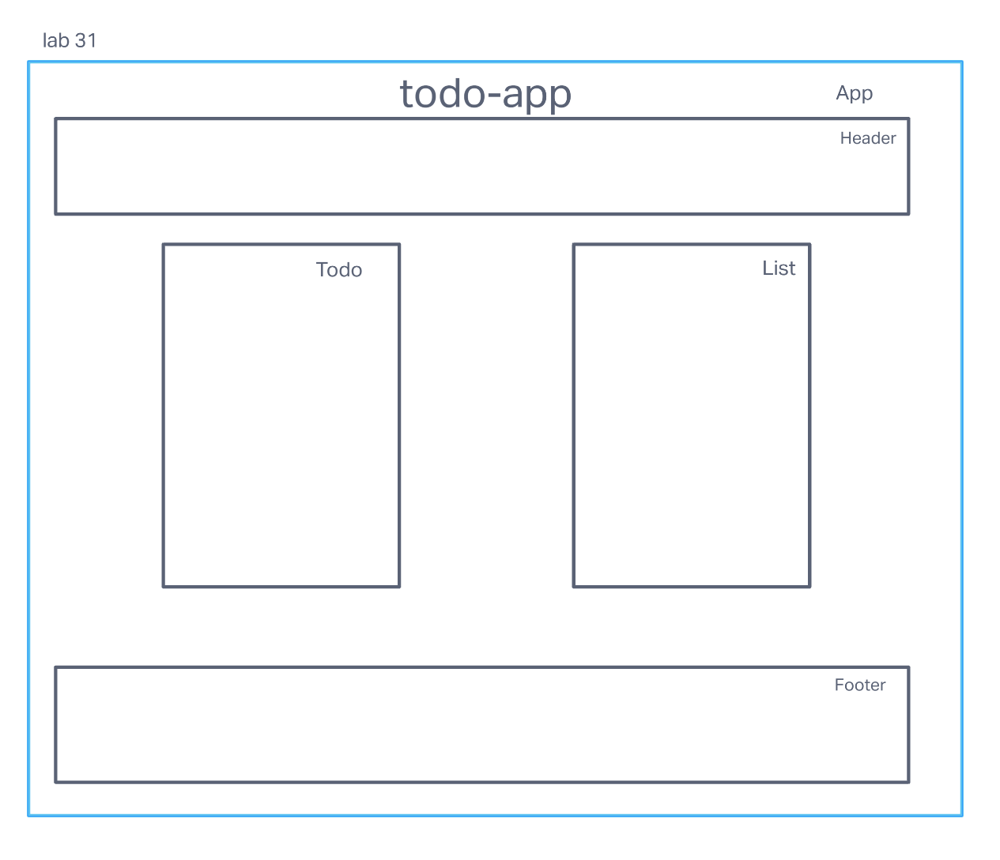

# LAB - Class 31

## Project: Todo-app

### Author: Steve Gant

### Problem Domain  

- To Do List Manager *Phase 1*: Incorporate configuration settings to the application.

### Links and Resources

- [GitHub PR -Lab32](https://github.com/stevengant/todo-app/pull/4) 
- [CodeSandbox - Lab32](https://codesandbox.io/p/github/stevengant/todo-app/context-methods?workspaceId=8be27d1e-468c-4d8f-a4af-75875ccb2c76&file=%2FREADME.md)

### Setup

+ `npm install`

#### How to initialize/run your application (where applicable)

+ e.g. `npm start`

#### Features

+ Routes
  + `/` - home page with the Todo form
  + `/setting` - setting form to change the setting and save them in local storage

+ Feature One: Todo list
  + Based on user preferences, show listings in groups of (3, 5, etc) and provide the ability to view multiple “pages” of results.
  + Each item in list should show the text of the item as well as the assignee.
    + Based on user preferences, hide or show completed items.
    + If shown, completed items should be styled differently making their status visually obvious.

+ Feature Two: Setting Form
  + Form containing `<Switch>`, `<NumberInput>`, `<TextInput>`, and `<Button>`
    + `<Switch>` - to toggle the visibility of the completed tasks
    + `<NumberInput>` - to input the number of items per page
    + `<TextInput>` - to input keyword to sort list by
    + `<Button>` - to render the current/updated settings

#### Tests

+ Footer.test.jsx
  + displays footer text as expected

+ Todo.test.jsx
  + render a header element as expected

#### UML

